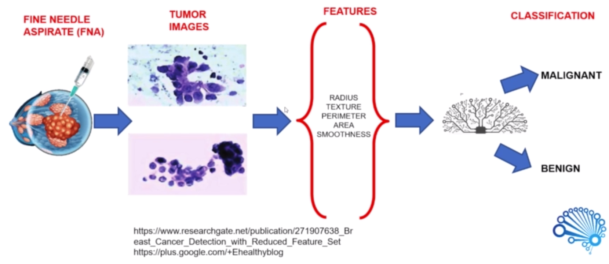

# Breast Cancer Classification - SVM
## Introduction

As from [World Cancer Research Fund](https://www.wcrf.org/dietandcancer/breast-cancer), Breast cancer is the most common cancer in women worldwide, with nearly 1.7 million new cases diagnosed in 2012, representing about 25 per cent of all cancers in women. Early diagnosis significantly increases the chances of survival.

The key challenge in cancer detection is how to **_classify tumors into Malignant or Benign_**. Machine Learning techniques can dramatically improve the accuracy of diagnosis. Research indicates that most experienced physicians can diagnose cancer with 79 percent accuracy, while 91 percent correct diagnosis is achieved using Machine Learning techniques. In this case study our task is to classify tumors into Malignant or Benign tumors using features from several cell images.

Let's take a look at the cancer diagnosis and classification process. The first step is to do **_final needle aspirate(FNA)_**, a process which is extracting some of the cells out of the tumor. They describe characteristics of the cell nuclei present in the image. We take images of the extract and feed the features like radius, texture, perimeterarea, smoothness and so on into our machine learning model to train it to classify tumor as Malignant or Benign. Once the model is trained we're good to go. We can use it in practice to classify new images.

**_Benign_** means the tumor is kind of not spreading across the bodies of the patient. So the patient is safe somehow. **_Malignant_** means it is cancerous. That means we need to intervene and actually stop the cancer growth.

## 

## Problem Statement

*   Predicting if the cancer diagnosis is benign or malignant based on several observations/features
*   30 features are used, examples:

          - radius (mean of distances from center to points on the perimeter)
          - texture (standard deviation of gray-scale values)
          - perimeter
          - area
          - smoothness (local variation in radius lengths)
          - compactness (perimeter^2 / area - 1.0)
          - concavity (severity of concave portions of the contour)
          - concave points (number of concave portions of the contour)
          - symmetry 
          - fractal dimension ("coastline approximation" - 1)

*   Datasets are linearly separable using all 30 input features

*   Number of Instances: 569
*   Class Distribution: 212 Malignant, 357 Benign
*   Target class:

           - Malignant
           - Benign

[https://archive.ics.uci.edu/ml/datasets/Breast+Cancer+Wisconsin+(Diagnostic)](https://archive.ics.uci.edu/ml/datasets/Breast+Cancer+Wisconsin+(Diagnostic))
